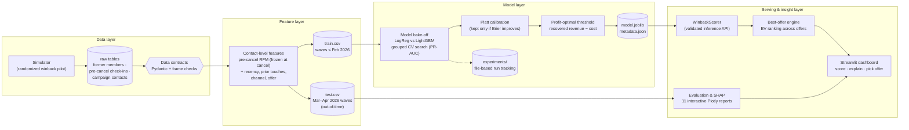

<div align="center">


[](https://github.com/joaocordova/gym-winback-prediction/actions/workflows/ci.yml)


**[📸 Dashboard](#-the-dashboard) · [🏗 Architecture](#2-system-architecture) · [📊 Performance](#6-model-performance) · [💰 Business impact](#7-business-impact) · [🚀 Quickstart](#8-quickstart)**

</div>

---

> **TL;DR (out-of-time campaign waves):** ROC-AUC **0.756** · PR-AUC **0.246** (2.6× the 9.5% base rate) · **3.0× lift** in the top decile. Contacting only the model's top 20% captures **48% of all reactivations** at **1.54× ROI ≈ $19,000 profit per wave** — versus $3,970 for the blanket "contact everyone" campaign and $1,219 for random targeting of the same size.

🏋️ Sibling project: **[gym-churn-prediction](https://github.com/joaocordova/gym-churn-prediction)** predicts who is *about to* leave; this project handles the members you already lost.

## 📸 The dashboard

The signature view: score a cancelled member and let the **offer optimizer** pick the incentive with the highest expected value — here a *personal-trainer session* wins for a low-usage churner, exactly the interaction the model was supposed to learn:


Campaign planner — propensity tiers, ranked winback queue and expected wave economics:


```bash
streamlit run app.py   # → http://localhost:8501
```

## 1. Business problem

Every gym has a graveyard of cancelled members — and win-back is the cheapest acquisition channel there is (the member already knows the gym; you already know them). But blanket "come back!" blasts burn staff time and incentive budget on people who moved away. This system answers three questions before each campaign wave:

1. **Who** among the cancelled base is winnable in the next 60 days?
2. **Which offer** (none / 20% discount / free month / PT session) maximises expected value *for that specific member*?
3. **Where to stop** — for whom does outreach cost exceed expected recovered revenue?

## 2. System architecture



**Leakage discipline:** pre-cancel behaviour is frozen at the cancellation date (it can never change afterwards); contact context is known when the contact list is drawn. The split is temporal on the contact date — the model trains on older campaign waves and is evaluated on waves it never saw — and all CV/validation splits are **grouped by member_id**.

**Why offers are learnable:** the simulated pilot **randomizes** channel and offer assignment, so offer effects (and their interaction with the cancellation reason) are identified rather than confounded by prior targeting policy — mirroring how a real winback pilot should be run before a model takes over targeting.

## 3. Tech stack

| Layer | Technology |
|---|---|
| Data contracts | **Pydantic v2** row models + vectorised frame contracts + referential integrity (no check-in after cancel; no contact before cancel) |
| Features | pandas contact-level pipeline (documented feature dictionary) |
| Models | **LightGBM** vs LogisticRegression bake-off, `RandomizedSearchCV` + `GroupKFold` |
| Calibration | Platt scaling, kept only when it improves Brier on a held-out half |
| Decisioning | profit-optimal threshold + **per-member expected-value offer selection** |
| Experiment tracking | file-based MLflow-style tracker (`experiments/`) |
| Explainability | **SHAP** (global beeswarm + per-contact waterfall) |
| Visualisation | **Plotly** interactive HTML + PNG snapshots, single validated color system |
| UI | **Streamlit** dashboard with offer optimizer |
| Quality | **pytest** (61 tests incl. an end-to-end pipeline run), GitHub Actions CI, Dockerfile |
| Logging | **Loguru** console + structured JSON-lines audit logs |

## 4. Key engineering features

- **Contact-level prediction unit** — the model scores *(member, date, channel, offer)* tuples, not members, so the same member can be cold today and hot with a different offer next month.
- **Offer economics built in** — incentive cost is only paid on redemption; expected value per contact is `p × (fee × expected_stay − offer_cost) − contact_cost`, and the dashboard ranks all four offers per member by EV.
- **Fail-fast config** — one Pydantic-validated `configs/config.yaml`; an unknown offer name or a train cutoff outside the data window dies at load time.
- **Honest simulator** — reactivation propensity decays with time-since-cancel (e-folding ≈ 60 days), relocated members are near-unwinnable, repeat contacts face diminishing returns, and offer × reason interactions (discount ↔ price-churner, PT session ↔ low-usage churner) are baked in for SHAP to find. See [`docs/data_generation.md`](docs/data_generation.md).
- **Reproducible experiments** — tracked runs under `experiments/`, deterministic under `random_seed`.

## 5. Evaluation gallery

All charts are **interactive Plotly HTML** in [`assets/`](assets/) (hover, zoom); PNG snapshots below.

| | |
|:---:|:---:|
| **Offer effectiveness (randomized pilot readout)**<br> | **Reactivation by reason × recency**<br> |
| **Cumulative gains & lift**<br> | **SHAP beeswarm — what drives winback**<br> |
| **Campaign profit vs threshold**<br> | **Precision–recall tradeoff**<br> |

<details>
<summary>Full chart list (11 interactive reports)</summary>

`roc_curve` · `pr_curve` · `calibration_curve` · `confusion_matrix` · `gains_lift` · `profit_curve` · `score_distribution` · `cohort_winback` · `offer_effectiveness` · `shap_importance` · `shap_beeswarm`

</details>

## 6. Model performance

Out-of-time test — Mar–Apr 2026 waves, 3,424 contacts the model never saw:

| Metric | Value | Notes |
|---|---|---|
| ROC-AUC | **0.756** | winback is intrinsically harder than churn — most behavioural signal froze at cancellation |
| PR-AUC | **0.246** | vs 0.095 base rate → **2.6×** |
| Precision @ profit threshold | **0.167** | threshold 0.078, chosen for max profit |
| Recall @ profit threshold | **0.782** | |
| Precision @ top 10% | **0.284** | **3.0× lift** over random |
| Recall @ top 20% | **0.483** | top quintile captures ~half of all reactivations |

Candidate bake-off (CV PR-AUC): LightGBM 0.264 vs LogisticRegression 0.238 — the boosted model wins on the offer × reason interactions, and the margin is honestly reported in `models/metadata.json`.

## 7. Business impact

From `assets/business_impact.json` — out-of-time waves (**3,424 contacts to 2,477 former members**, avg fee $61):

| Strategy | Contacts | Reactivations captured | Profit / wave | ROI |
|---|---|---|---|---|
| **Model, top quintile** | 685 (20%) | 157 (48% of all) | **+$18,964** | **1.54×** |
| **Model, profit-optimal threshold** | 1,519 (44%) | 254 (78% of all) | **+$23,919** | 0.87× |
| Blanket campaign (contact everyone) | 3,424 (100%) | 325 | +$3,970 | 0.06× |
| Random targeting, quintile budget | 685 (20%) | ~65 expected | +$1,219 | — |

**Model uplift vs random targeting at the same budget: ≈ $17,700 per wave.** Assumptions — 4.0 retained months per reactivation, $18 contact cost, offer costs paid only on redemption — all configurable in `configs/config.yaml`.

## 8. Quickstart

```bash
git clone https://github.com/joaocordova/gym-winback-prediction.git && cd gym-winback-prediction
pip install -e ".[app,dev]"       # or: pip install -r requirements.txt

python -m gym_winback.cli all     # simulate → features → train → evaluate → explain
pytest                            # 61 tests, includes an end-to-end pipeline run
streamlit run app.py              # launch the dashboard
```

Stage by stage: `python -m gym_winback.cli simulate|features|train|evaluate|explain` (or `make pipeline`, `make test`, `make app`).

### Docker

```bash
docker build -t gym-winback .
docker run -p 8501:8501 gym-winback   # dashboard at http://localhost:8501
```

## 9. Repository layout

<details>
<summary>Click to expand</summary>

```
gym-winback-prediction/
├── app.py                      # Streamlit dashboard (incl. offer optimizer)
├── configs/config.yaml         # single validated source of every tunable
├── src/gym_winback/
│   ├── config.py               # Pydantic-typed config loader (fail-fast)
│   ├── schemas.py              # data contracts: row models + frame contracts
│   ├── simulation.py           # randomized winback-pilot simulator
│   ├── features.py             # contact-level feature layer
│   ├── models.py               # candidates, preprocessing, calibration wrapper
│   ├── train.py                # grouped CV bake-off + calibration + threshold
│   ├── evaluate.py             # metrics + 9 interactive evaluation reports
│   ├── explain.py              # SHAP global + per-contact explanations
│   ├── business.py             # probabilities → dollars + best-offer engine
│   ├── predict.py              # WinbackScorer: validated inference API
│   ├── tracking.py             # file-based experiment tracker
│   ├── plotting.py             # one validated visual system for every chart
│   └── cli.py                  # pipeline entry points
├── tests/                      # 61 pytest tests (unit + end-to-end)
├── docs/                       # feature dictionary, data-generation assumptions
├── assets/                     # interactive HTML reports (+ PNG in assets/img)
├── models/ · experiments/ · data/sample/
├── Dockerfile · Makefile · .github/workflows/ci.yml
└── requirements.txt · pyproject.toml
```

</details>

## 10. Documentation

- [`docs/feature_dictionary.md`](docs/feature_dictionary.md) — every feature, its window, and the business logic behind it
- [`docs/data_generation.md`](docs/data_generation.md) — the randomized-pilot simulator's assumptions and why they matter

## License

MIT
