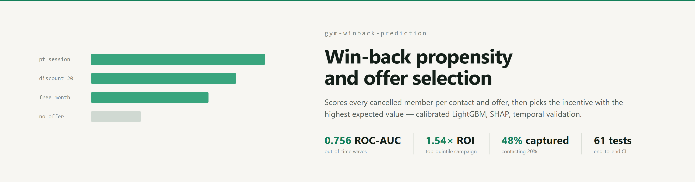
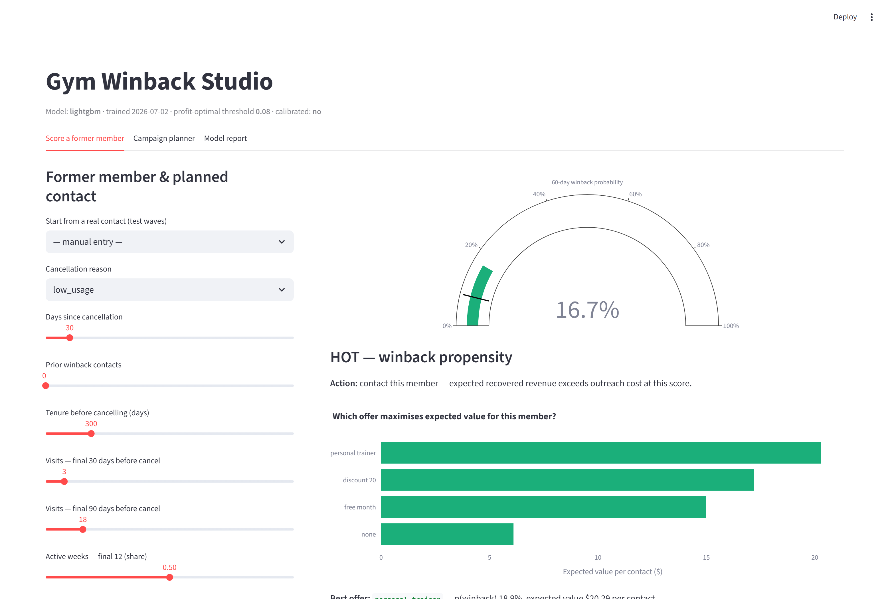
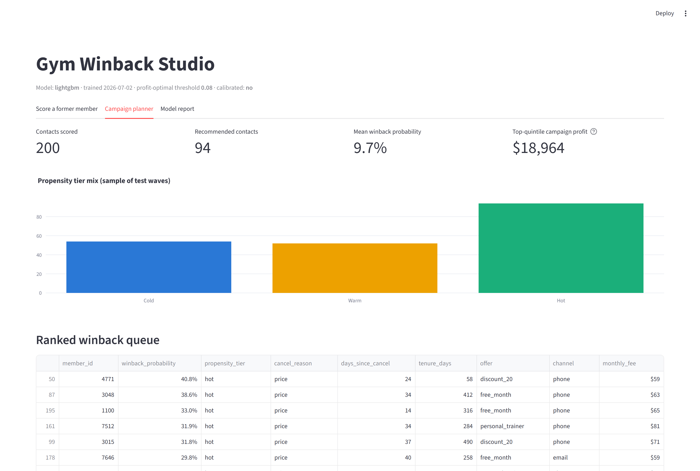
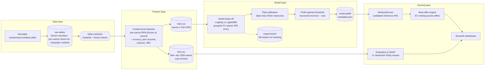
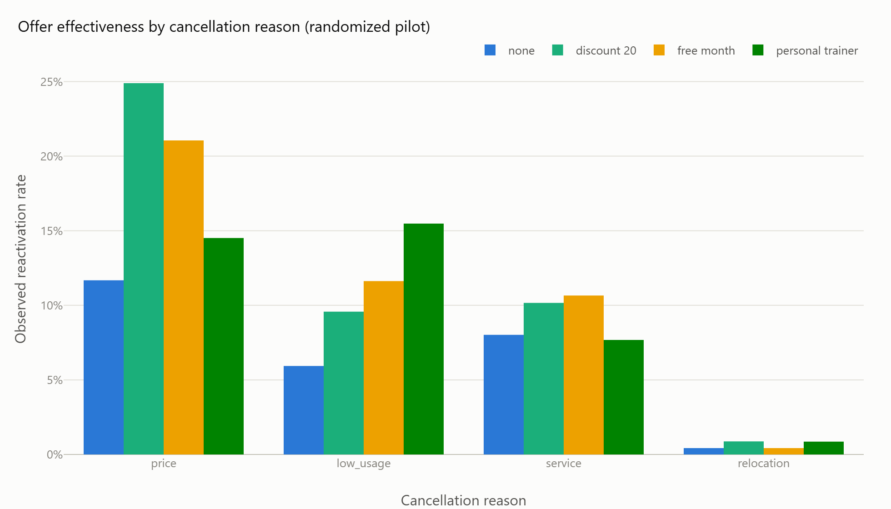
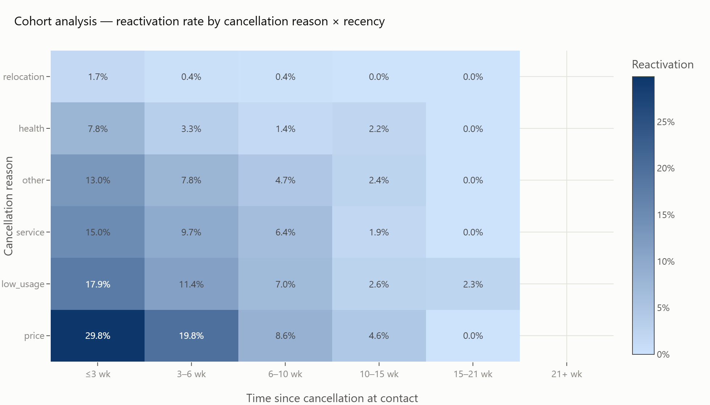
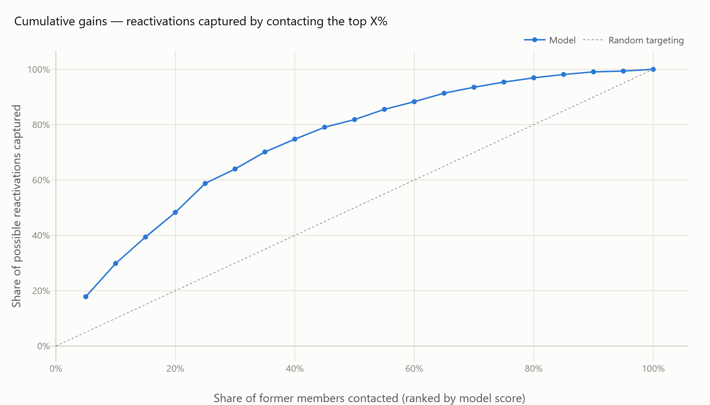
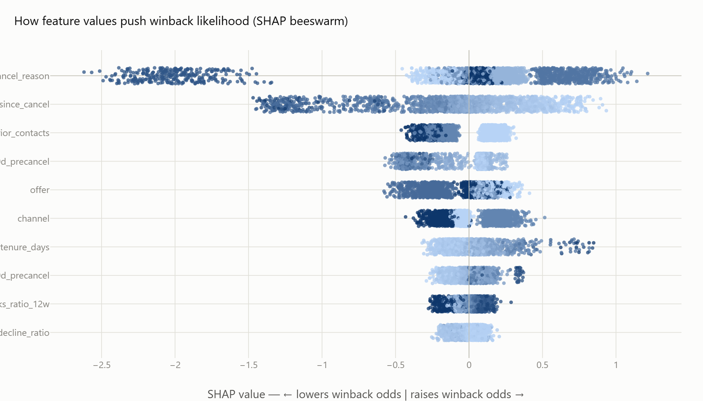
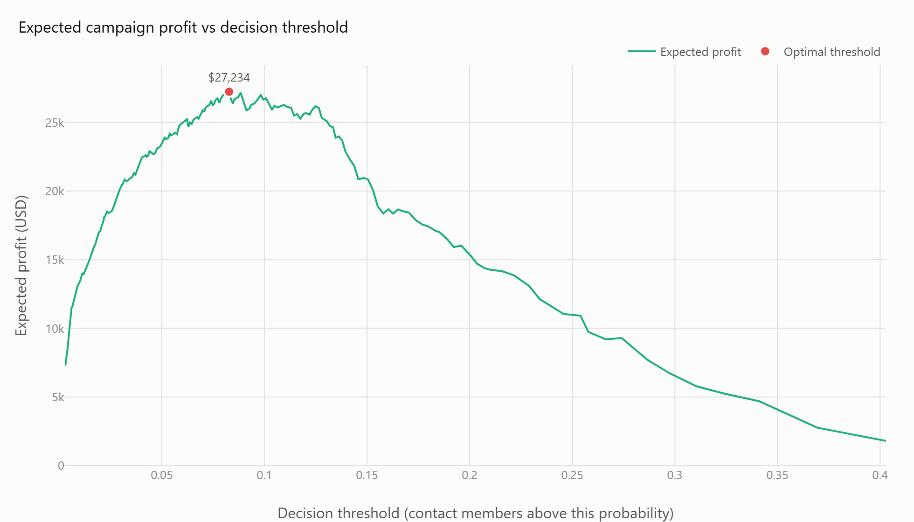
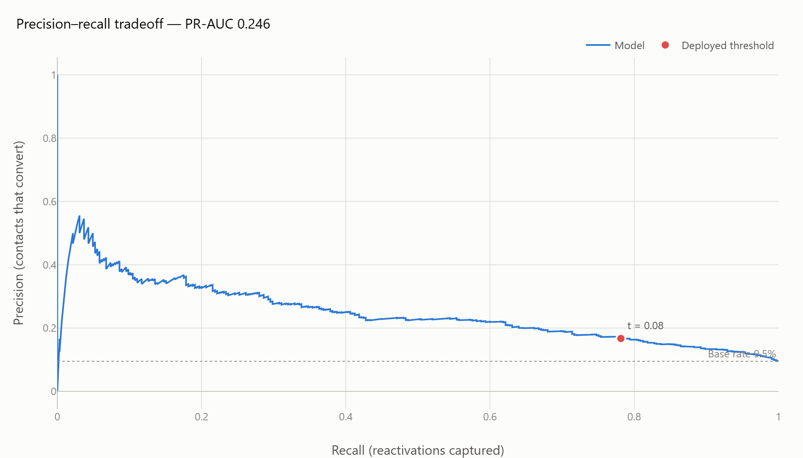

# gym-winback-prediction

[](https://github.com/joaocordova/gym-winback-prediction/actions/workflows/ci.yml)


Production-style ML system for win-back campaigns. It scores every cancelled gym member's probability of reactivating within 60 days of an outreach contact, explains each score with SHAP, and selects the incentive (none, 20% discount, free month, personal-trainer session) with the highest expected value for that specific member. The prediction unit is a contact — member, date, channel, offer — so the same member can be a poor target today and a good one next month with a different offer.

**Results on out-of-time campaign waves** (Mar–Apr 2026, 3,424 contacts the model never saw): ROC-AUC 0.756, PR-AUC 0.246 against a 9.5% base rate, 3.0x lift in the top decile. Contacting only the model's top 20% captures 48% of all reactivations at 1.54x ROI (~$19,000 profit per wave), versus 0.06x ROI for the blanket contact-everyone campaign.

Companion project: [gym-churn-prediction](https://github.com/joaocordova/gym-churn-prediction) — predicting cancellation before it happens; this project handles the members already lost.

## Dashboard

Scoring a cancelled member: reactivation probability for the planned contact, the expected-value ranking across all four offers, and the SHAP explanation. In the example below the offer engine picks a personal-trainer session for a member who cancelled for low usage — the interaction the model is expected to learn from the randomized pilot data:



Campaign planner — propensity tiers, ranked winback queue, expected wave economics:



```bash
streamlit run app.py   # http://localhost:8501
```

## Problem

Win-back is the cheapest acquisition channel a gym has — the member already knows the gym, and the gym already knows the member. But blanket "come back" blasts spend staff time and incentive budget on people who moved away or will never return. Before each campaign wave the system answers: who among the cancelled base is winnable in the next 60 days; which offer maximises expected value per member; and where outreach stops paying for itself.

## Architecture



Design decisions that carry the system:

- **Leakage discipline.** Pre-cancellation behaviour is frozen at the cancellation date — it cannot change afterwards. Contact context (days since cancel, prior touches, channel, offer) is known when the contact list is drawn. The split is temporal on the contact date: the model trains on older campaign waves and is evaluated on waves it never saw, and every CV/validation split is grouped by `member_id`.
- **Offer effects are identified, not assumed.** The simulated pilot randomizes channel and offer assignment, so offer × cancellation-reason interactions (discount for price churners, guided-restart sessions for low-usage churners) can be read from the data rather than echoing an old targeting policy. This mirrors how a real winback program should be piloted before a model takes over targeting.
- **Economics in the loop.** Incentive cost is paid only on redemption. Expected value per contact is `p × (fee × expected_stay − offer_cost) − contact_cost`; the deployed threshold maximises realized campaign profit on held-out waves, and the offer engine ranks all four offers per member by EV.
- **Data contracts at every boundary.** Row and frame contracts on all raw tables, cross-table integrity rules (no check-in after cancellation, no contact before it, no contact after a successful reactivation), and schema validation of every inference payload.
- **Tracked, reproducible training.** Runs are recorded under `experiments/` and the whole pipeline is deterministic under the configured seed.

## Stack

| Concern | Choice |
|---|---|
| Data contracts | Pydantic v2 row models, vectorised frame contracts, referential integrity |
| Features | pandas contact-level pipeline ([feature dictionary](docs/feature_dictionary.md)) |
| Models | LightGBM vs LogisticRegression bake-off, RandomizedSearchCV + GroupKFold |
| Calibration | Platt scaling, retained only on measured Brier improvement |
| Decisioning | profit-optimal threshold + per-member expected-value offer selection |
| Tracking | file-based run tracker (params/metrics/artifacts + JSONL index) |
| Explainability | SHAP: global beeswarm, per-contact waterfall |
| Reports | Plotly interactive HTML + PNG snapshots |
| Serving | WinbackScorer class + Streamlit operator dashboard |
| Quality | pytest (61 tests incl. a full pipeline run), GitHub Actions CI, Dockerfile |
| Logging | Loguru console + structured JSON-lines audit logs |

## Evaluation

All charts are interactive Plotly HTML under [`assets/`](assets/); static snapshots below.

| | |
|:---:|:---:|
| Offer effectiveness by cancellation reason<br> | Reactivation by reason × recency<br> |
| Cumulative gains and lift<br> | SHAP beeswarm — winback drivers<br> |
| Campaign profit vs threshold<br> | Precision–recall tradeoff<br> |

| Metric (out-of-time waves) | Value |
|---|---|
| ROC-AUC | 0.756 |
| PR-AUC | 0.246 (base rate 0.095) |
| Precision / recall @ profit threshold (0.078) | 0.167 / 0.782 |
| Precision @ top 10% | 0.284 (3.0x lift) |
| Recall @ top 20% | 0.483 |

Winback is intrinsically harder than churn prediction — most behavioural signal froze at cancellation, and the dominant drivers are the cancellation reason and recency. The bake-off (CV PR-AUC: LightGBM 0.264 vs LogisticRegression 0.238) and the winning hyperparameters are recorded in `models/metadata.json`.

## Business impact

From `assets/business_impact.json` — out-of-time waves, 3,424 contacts to 2,477 former members, average fee $61:

| Strategy | Contacts | Reactivations captured | Profit / wave | ROI |
|---|---|---|---|---|
| Model, top quintile | 685 (20%) | 157 (48% of all) | +$18,964 | 1.54x |
| Model, profit-optimal threshold | 1,519 (44%) | 254 (78% of all) | +$23,919 | 0.87x |
| Blanket campaign (everyone) | 3,424 (100%) | 325 | +$3,970 | 0.06x |
| Random targeting, quintile budget | 685 (20%) | ~65 | +$1,219 | — |

Assumptions (4.0 retained months per reactivation, $18 contact cost, offer costs paid only on redemption) are levers in `configs/config.yaml`.

## Running the project

```bash
git clone https://github.com/joaocordova/gym-winback-prediction.git && cd gym-winback-prediction
pip install -e ".[app,dev]"       # or: pip install -r requirements.txt

python -m gym_winback.cli all     # simulate -> features -> train -> evaluate -> explain
pytest                            # 61 tests, includes an end-to-end pipeline run
streamlit run app.py
```

Individual stages: `python -m gym_winback.cli simulate|features|train|evaluate|explain`. Make targets: `make pipeline`, `make test`, `make app`.

Docker:

```bash
docker build -t gym-winback .
docker run -p 8501:8501 gym-winback
```

## Limitations and next steps

- **Propensity is not uplift.** The model ranks by probability of reactivation given contact; it cannot distinguish members who would have returned anyway. The randomized pilot data is exactly what an uplift model (e.g., T-learner over offer arms) needs — that is the natural next iteration.
- **Offer selection ignores budget constraints.** The EV ranking is per-member greedy; a wave with a fixed incentive budget calls for a knapsack-style allocation across the queue.
- **Contact fatigue is modelled, not learned online.** Diminishing returns on repeat contacts come from the pilot data; a production system should update these estimates as new waves land.

## Repository layout

<details>
<summary>Expand</summary>

```
gym-winback-prediction/
├── app.py                      # Streamlit dashboard (incl. offer engine)
├── configs/config.yaml         # single validated source of every tunable
├── src/gym_winback/
│   ├── config.py               # Pydantic-typed config loader (fail-fast)
│   ├── schemas.py              # data contracts: row models + frame contracts
│   ├── simulation.py           # randomized winback-pilot simulator
│   ├── features.py             # contact-level feature layer
│   ├── models.py               # candidates, preprocessing, calibration wrapper
│   ├── train.py                # grouped CV bake-off + calibration + threshold
│   ├── evaluate.py             # metrics + interactive evaluation reports
│   ├── explain.py              # SHAP global + per-contact explanations
│   ├── business.py             # probabilities -> dollars + best-offer engine
│   ├── predict.py              # WinbackScorer: validated inference API
│   ├── tracking.py             # file-based experiment tracker
│   ├── plotting.py             # shared chart theming
│   └── cli.py                  # pipeline entry points
├── tests/                      # 61 pytest tests (unit + end-to-end)
├── docs/                       # feature dictionary, data-generation assumptions
├── assets/                     # interactive HTML reports (+ PNG in assets/img)
├── models/ · experiments/ · data/sample/
├── Dockerfile · Makefile · .github/workflows/ci.yml
└── requirements.txt · pyproject.toml
```

</details>

## Documentation

- [docs/feature_dictionary.md](docs/feature_dictionary.md) — every feature, its window, and the business logic behind it
- [docs/data_generation.md](docs/data_generation.md) — the randomized-pilot simulator's assumptions

## License

MIT
